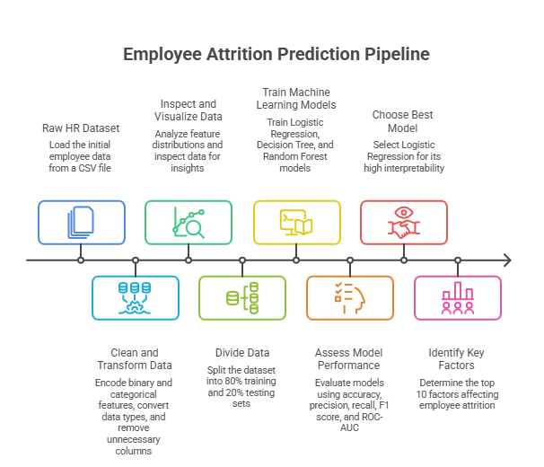
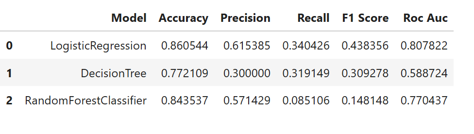
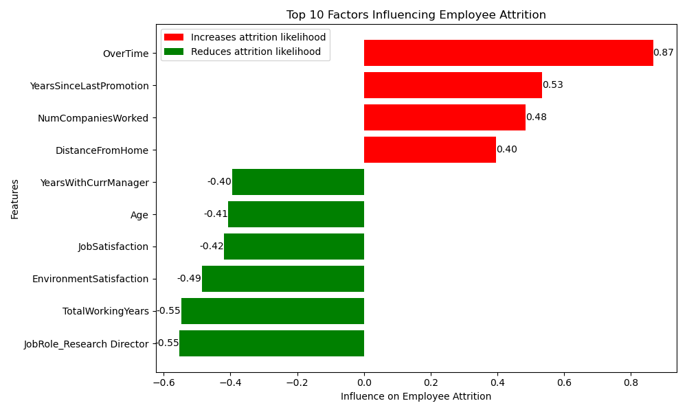

# Employee Attrition Prediction

A machine learning pipeline that predicts which employees are likely to leave a company, and explains which factors drive that risk.

## What this is

An end-to-end classification workflow built on a classic HR dataset (age, income, department, overtime, satisfaction scores, and 25+ other attributes per employee). The notebook cleans and encodes the raw data, trains and compares three classification models, and produces a ranked, signed feature-importance chart showing what actually pushes attrition risk up or down. The goal isn't just a Yes/No prediction — it's a result an HR team can act on.

```
Raw HR data          Clean & encode         Train 3 models        Explain
     |                     |                      |                   |
     v                     v                      v                   v
Employee.csv  --->  binary + one-hot   --->  LogisticRegression  ---> feature
                     encoded features         DecisionTree            importance
                                               RandomForest            chart
```



## Prerequisites

- Python 3.10+
- `pandas`, `matplotlib`, `scikit-learn`, `jupyter`

## Quick start

### 1. Clone the repository

```
git clone https://github.com/<your-username>/<your-repo>.git
cd <your-repo>
```

### 2. Install dependencies

```
pip install pandas matplotlib scikit-learn jupyter
```

### 3. Add the dataset

Place `Employee.csv` in the repository root, alongside `employee.ipynb`.

### 4. Run the notebook

```
jupyter notebook employee.ipynb
```

Run all cells top to bottom. The notebook is self-contained — no external config or environment variables required.

## Notebook structure

| Section | What it does |
|---|---|
| 1. Load and explore | Reads `Employee.csv`, checks the Attrition class balance |
| 2. Encode binary columns | Converts Yes/No-style columns to `0`/`1` |
| 3. One-hot encode categories | Expands multi-value columns (Department, JobRole, etc.) into binary columns |
| 4. Normalize data types | Casts one-hot `bool` output to `int` |
| 5. Drop non-informative columns | Removes IDs and constant-value columns |
| 6. Visualize distributions | Histograms every numeric feature |
| 7. Split data and define models | 80/20 stratified split; defines LogisticRegression, DecisionTree, RandomForest |
| 8. Train and compare | Scores all three models on accuracy, precision, recall, F1, ROC-AUC |
| 9. Select the working model | Fixes `selected_model` to LogisticRegression for interpretability |
| 10. Explain the model | Signed, ranked bar chart of the top 10 features by influence |

## How the model selection works

- **Three models, one comparison table.** LogisticRegression, DecisionTreeClassifier, and RandomForestClassifier are trained on the same split and scored on five metrics side by side, rather than picking a single "winner" metric in isolation.

  

  LogisticRegression actually tops the table on accuracy (0.861) and ROC-AUC (0.808), and also posts the strongest recall (0.34) and F1 (0.44) of the three. DecisionTree and RandomForest both trail on nearly every metric, so the choice below isn't really a tradeoff of accuracy for interpretability — here LogisticRegression wins on both.

- **Interpretability over raw accuracy.** `selected_model` is explicitly set to LogisticRegression in the notebook, independent of which row tops `results_df`. Linear coefficients can be read directly as "this feature raises or lowers attrition risk by X," which a tree ensemble can't offer as cleanly.

- **Feature importance, not a black box.** The final chart takes the model's coefficients, ranks them by absolute value, and colors them by sign — turning a matrix of weights into a chart a non-technical reader can act on directly.

  

  Overtime is the single strongest driver of attrition risk, followed by time since last promotion, number of companies previously worked at, and distance from home. Tenure with a current manager, age, job/environment satisfaction, and total working years all push risk down.

## Customization

| To change | Edit |
|---|---|
| The dataset | Swap `Employee.csv` and adjust `category_elements` in section 3 to match your categorical columns |
| Which model is explained | Change the key passed to `models[...]` in section 9 |
| Number of features shown | Change `.head(10)` in section 10 |
| Models compared | Add or remove entries in the `models` dict in section 7 |

## Tips for better results

- **Check the class balance first.** This dataset skews roughly 6:1 toward "stayed." Accuracy alone will look strong even from a weak model — read precision, recall, and ROC-AUC together.
- **Re-run section 9 deliberately.** If you swap in RandomForest as `selected_model`, the coefficient-based chart in section 10 won't work as-is — tree-based models need `.feature_importances_` instead of `.coef_`.

## Next steps

- Address class imbalance (e.g. `SMOTE` or class-weighted models)
- Cross-validate rather than relying on a single train/test split
- Tune hyperparameters for `RandomForestClassifier`, which is left at defaults here
- Wrap `selected_model` in a small script or API for scoring new employee records on demand

## Repository structure

```
.
├── employee.ipynb          # main notebook — run top to bottom
├── Employee.csv             # dataset (add this yourself, see Quick start)
├── images/
│   ├── pipeline.png          # end-to-end pipeline overview
│   ├── model_evaluation.png  # 3-model comparison table
│   └── feature_importance.png # top-10 signed feature-importance chart
└── README.md
```

## Acknowledgements

Built around the widely-used IBM HR Analytics Employee Attrition dataset.

## License

MIT
